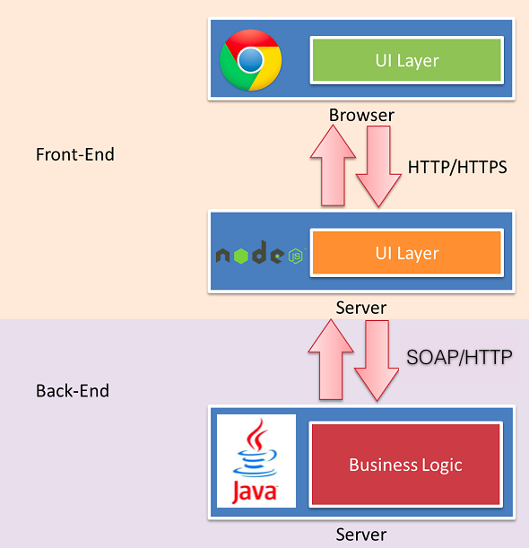
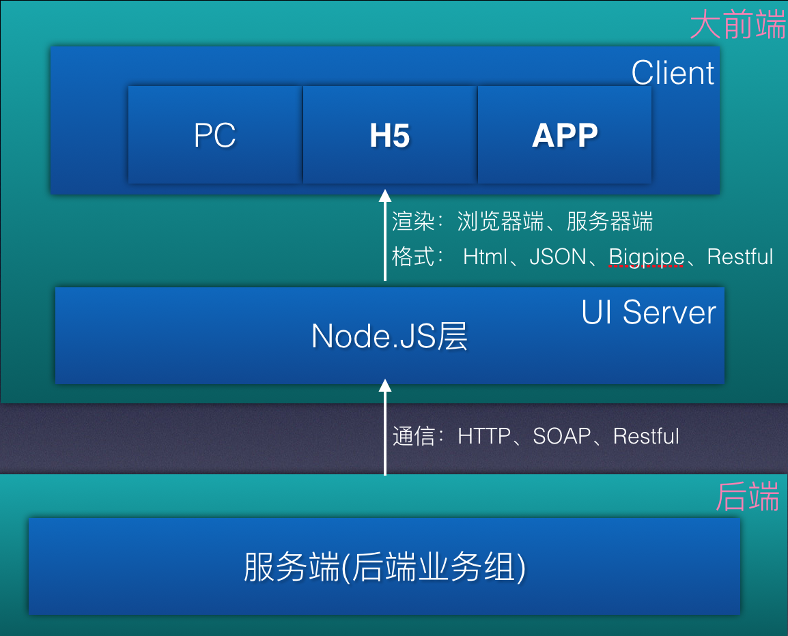
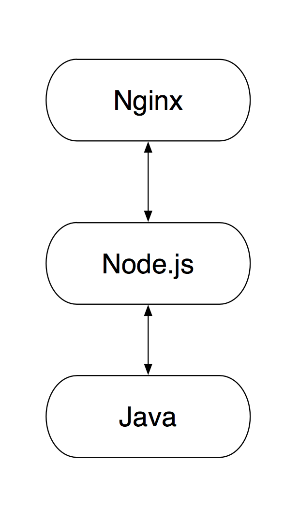
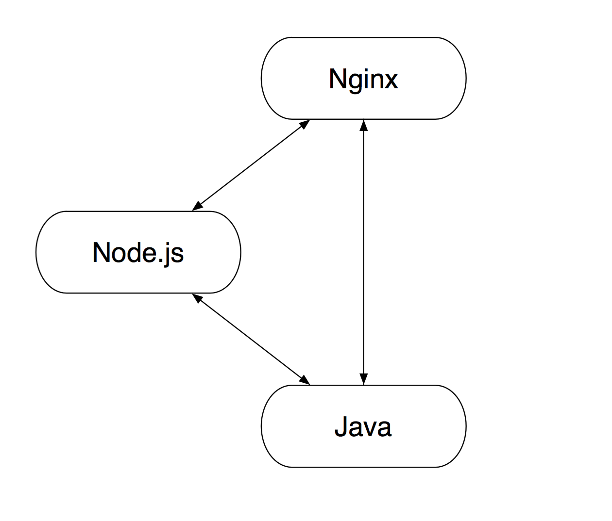

# 前端端分离推进方案

本文主要分为前后端分离相关介绍、WE.COM前后端分离推进规范两部分说明。

前后端分离部分主要介绍了：什么是前后端分离、为什么要做前后端分离、以及业界比较常见的前后端分离方案、架构。

第二部分着重介绍了WE.COM如何分期递进式的推进该方案、以及一期设计各个技术小组需要支持的关键点。

## 什么是前后端分离

大家一致认同的前后端分离的例子就是SPA(单页面应用)，前后端通过Ajax交互获取数据。

### 后端职责

代码运行在服务器端

* 提供数据
* 处理业务逻辑
* Server 端MVC架构维护

### 前端职责

代码运行在浏览器端

* 请求、处理后端数据
* 处理渲染逻辑
* 浏览器端 MVC架构维护

从某种意义上来说，SPA确实做到了前后端分离，但这种方式存在以下几个问题：

### 性能问题
 
* **浏览器端**处理数据、渲染页面有性能问题
* 需要等到资源全部加载完成才能渲染页面,会有**白屏、闪烁**情况
* 移动设备**网速低、建立连接时间长**体验非常差
 
### 复用问题

* **模板**无法在前后端复用
* **逻辑**无法复用,常见如表单检验,需要前后端各做一次
* **路由**无法复用,前后端各自维护MVC模型
* **跨端**复用,逻辑代码过于靠前,无法跨PC、H5、App多终端复用

### SEO问题

* 浏览器端渲染模板,**SEO效果非常差**

### 开发成本问题

* WEB服务中，SPA类占的比例很少。很多场景下还有同步/同步+异步混合的模式，SPA不能作为一种通用的解决方案。
* 现阶段的SPA开发模式，接口通常是按照展现逻辑来提供的，有时候为了提高效率，后端会帮我们处理一些展现逻辑，这就意味着后端还是涉足了View层的工作，不是真正的前后端分离。
* 相比传统的服务器端渲染开发模式SPA需要在前端处理大量(模板渲染、路由管理、Model层管理、SEO优化)，开发成本非常大

### 重新定义前后端分离

SPA式的前后端分离，是从物理层做区分（客户端的就是前端，服务器端的就是后端），这种分法已经无法满足我们前后端分离的需求，从职责上划分才能满足目前我们的使用场景：

    前端：负责View和Controller层(Server UI层)。
    后端：负责Model层，业务处理/数据等。

新的职责划分

* 前端

* Server UI

* 后端

## 为什么要前后端分离

### 关注点、职责分离

    前端不用在强依赖于负责的Java环境,以及后端数据的提供,也无需在模板中写Java代码转换数据格式 
    
    后端也可以摆脱对展现层的强关注,专心业务逻辑开发    

### 复用

    * 业务层只需提供统一的服务接口,UI层对接业务服务向上支持PC、H5、APP等不同的业务形态
    * 前端可以根据产品需求使用同一套模板,自由的在浏览器端渲染、服务器端渲染,不用像现在开发多套模板

### 前端能量释放

* 性能优化限制

        如果只在前端做空间非常有限，于是我们经常需要后端合作才能碰撞出火花，但由于后端框架限制，我们很难使用Comet、Bigpipe等技术方案来优化性能。

* SEO优化限制

        众所周知搜索引擎不会执行JS代码,导致大量的SPA网站、以及使用前端模板渲染的页面(WE理财目前几乎都是前端模板渲染页面)无法被搜索引擎抓取,对SEO影响非常之大

* 后端开发限制

        由于目前直接有Java业务层 (提供业务数据 + 渲染模板),导致业务层不可避免的或多或少都需要关心展现层,根据展现层提供相应的数据.
        增加了后端开发的复杂度以及后端的代码可维护性(业务层混杂着一些展现层的代码).

### 快速的迭代

通常来自产品、市场以及运营的需求多数是文案类、样式类、运营页、以及统计层面的一些需求,
新的前后端分离方案将使得这些需求通过模板层 + UI层就可以解决,无需后端的改动,支持速度将会大大提升.

### 业界前后端分离架构图

下图是Paypal的前后端分离架构示意图(PS国内诸如阿里、百度、美团、滴滴......前后端分离架构大抵基本相似):

## WE.COM前后端分离

### 架构和职责

* 架构图

* 职责划分

http://2014.jsconf.cn/slides/herman-taobaoweb/index.html#/69

### 为什么是Node.js

http://2014.jsconf.cn/slides/herman-taobaoweb/index.html#/67

More Than You Think

### WE.COM的前后端分离结构图

下图是WE.COM前后端分离的一些设想:

### 关于Node.js层 的一些疑问

* Node.js稳定性以及风险
* 前端工作量的增加
* 性能问题

## 前后端分离方案推进

### 一期 : 移动端独立业务需求(不涉及账户体系)

#### 目标

* 研发 : Node.js技术选型、基础框架搭建、node-log模块(监控、报警相关)
* 全流程串联 : Node.js方案开发全流程打通（开发、联调、提测、上线）
* 运维 : 线上Node.js依赖环境、线上部署部署方案

#### 项目

* 微信分享类需求、
* 季报、宣传页等静态页

### 二期 : 移动端非核心业务迁入Node.js

#### 目标

* 研发 : Node.js技术选型完善、前后端接口文档规范化(对于新人接手、QA测试都十分重要)
* UI Server层通用模块沉淀 : node-passport（用户登录态管理）、node-ral（node和后端通信层封装）、node-log模块(关系到监控、报警、后续数据统计)
* 运维 Server : 重点解决两个问题 Server稳定性;对接现有监控、报警工具;

#### 适合项目

* 大量的活动页(类似于基金活动、5周年活动) : 有较多数据交互、但又不涉及核心业务流程
* 网站稳定性监控、性能监控数据记录

### 三期 : PC非核心业务迁入Node.js

#### 目标

* 研发 : 达到上图所描绘前后端分离理想状态,Node Server层对接底层Java业务层,支持H5、PC等多种业务形态
* 测试 : UI Server层持续集成、自动化测试

#### 适合项目

* 主要是活动页、LP页、以及一些边缘业务

### 后续

......二期、三期之后在跟进情况规划后续......

## 一期方案设计

下面大致描述一期所涉及各个环节的关键问题：分别从前端、后端、测试、运维等四个方面说明Node.js一期需要做的一些事情。

### 大前端

如上图所示:大前端包含client和UI Server层两部分.下面会大致描述这两部分各自的技术选型:

#### 客户端

* 开发规范(目录结构)
* 组件化方案
* 模板选型
* 前端自动化编译工具

#### Server UI

* 服务端框架
* Node Server服务器
* 基础模块开发 (Node-log模块)
* 开发目录结构

这里大致罗列了client和Node Server层各自需要完成的一些工作(一期),具体设计后续会另起文档详细描述.

### 后端

引入Node.js层后,前后端采用HTTP(JSON)接口进行数据通信.对于后端影响不是很大,前后端可以更好的独立开发、测试:

    前后端商定数据接口
    前后端可以并行开发,因为基于HTTP接口可以方便各自独立模拟数据、测试
    前后端代码联调

### 测试

#### 环境依赖

* Node.js(5.2.0)
* PM2(最新版本)

#### 提测流程

Node.js是独立与home、mobile之外的一个子系统.能够独立提测、上线. 

包括: jenkins配置、编译打包脚本、

测试机部署、备机部署采用统一方法:

    1. 前端提供编译打包脚本(build.sh),由Jenkins执行脚本,生成tar包
    2. Jenkins负责将tar包部署到各个机器(包括备机)
    3. 前端提供Node Server (Start、Stop、Restart等脚本),Jenkins负责部署完成后自动重启Node Server

下面是前端打包脚本的具体流程(非前端同学可以不用关心)

    1. 下载仓库代码
    2. 下载node_modules : 独立git或者现有git独立目录、shrinkwrap固定版本
        
        dev
        pro
        
    3. copy node_modules ： 
    
        需要copy完整版本的node_modules
        是否需要提供Linux build版本、或者只是源码，打包前执行rebuild
        
    4. 编译client端代码 ： gulp + webpack
    5. 生成最终tar包

        copy pro版本node_modules到server里面 
        发布测试机、或者备机

    6. 部署代码、重启Node Server

### 运维

#### 环境依赖

* Node.js(5.2.0)
* PM2(最新版本)

#### 上线流程

* 如上所述,有Jenkins部署到备机,其他操作交由运维同学处理.大致和目前home、mobile等上线类似.

#### 线上部署方案

线上目前的Server部署方案 :

传统栈中首次引入Node.js这一层对我们还说还是有一定的风险.
为了稳妥起见，我们将整个迁移过程划分为多期进行,期间会有部分页面逐渐引入Node.js，其它页面沿用传统方案。
由 Nginx 判断请求的URL类型，决定这个请求究竟是要转发给Node.js还是Java。于是，最后的结构成了：

#### 监控、报警

监控、报警主要对接现有机制,研发提供特定格式的Log日志,由运维实时扫描报警.

### 参考资料

* http://2014.jsconf.cn/slides/herman-taobaoweb/index.html#/95
* http://vdisk.weibo.com/s/ulpCNXt8ePRUV?category_id=0&parents_ref=ulpCNXt8ePS5W,ulpCNXt8ePRJK
* http://ued.taobao.org/blog/2014/05/midway-deploy/