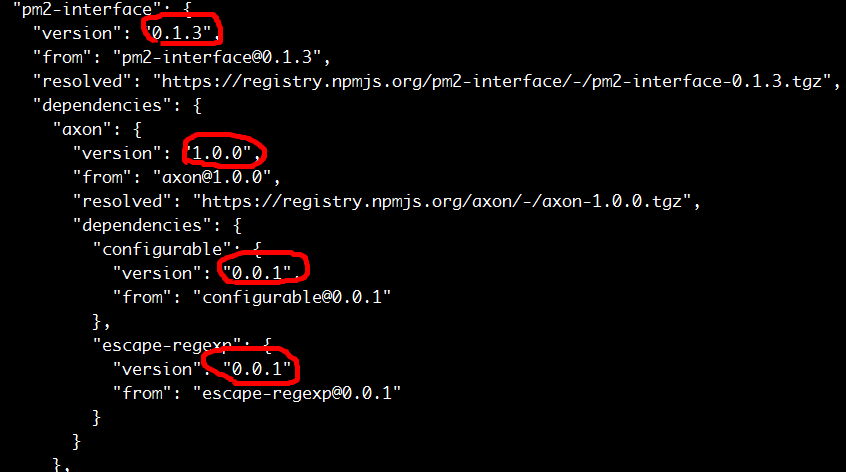
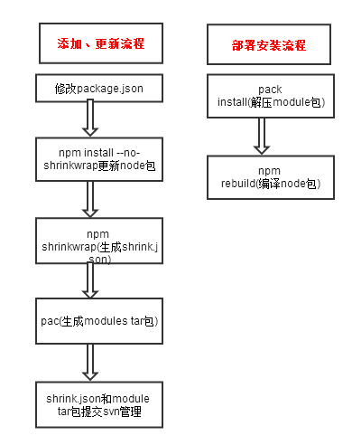

# node包管理方案

## 目的

该方案主要解决两个问题：

* 关于Node应用中依赖的公共资源包资源包如何管理
* 内部团队开发的私有资源包如何管理(下载、更新...)

## 现状

目前node应用关于依赖包的管理并没有成型的标准方案，通常情况下会采用下面两种办法：

1. 通过package.json管理所有的资源依赖，通过npm install下载、安装、编译、更新依赖的资源
1. 通过package.json和node_modules管理所有的资源依赖，node_modules提交svn管理，不用每次执行npm install

### 方案一的问题

方案一需要每次发布、部署应用是通过npm install下载、编译资源包所以就会导致一下几个问题：

* 由于依赖资源包的频繁更新从而引起产品不稳定

    例如：yog依赖于express，我们够保证yog依赖express的特定版本，但无法保证express自身依赖的资源包更新的问题，并且这种更新引起的bug非常难以定位

* 上线过程需要执行npm install更新资源，如果由于网络问题更新失败导致依赖下载资源不全，甚至可能引起线上bug

* 由于npm本身以及gfw的原因会导致时不时无法连接npm

### 方案二的问题

方案二一定程度避免了前一种方案npm install带来频繁更新问题，但也带来了新的问题：

* 通常node_modules文件都非常多加入svn管理，会导致每次代码编译、上线时间都会非常的长
* 同方案一一样，无法控制资源包版本更新问题，并且给测试、diff codereview都带来很大的麻烦
* 前两个问题还可以绕过去，这个问题就更加麻烦：如果依赖有环境相关(win、linux、mac)的类库(pm2)，因为node_modules是和特定的环境相关的，所以没办法做到完全的通用

目前文库暂时采用了第二种方案，从而导致svn内容非常冗余、node_modules只针对linux环境等问题。

## 公用资源包管理方案

### 1.shrinkwrap

[shrinkwrap](https://www.npmjs.org/doc/cli/npm-shrinkwrap.html)是npm内置命令，通过npm shrinkwrap命令，生成npm-shrinkwrap.json文件可以锁定依赖资源包的版本，install是会优先使用该文件安装依赖资源包。

例如执行yog执行npm shrinkwrap后得到类似下面的依赖关系：



### 2.node-pac和npm rebuild

[node-pac](https://github.com/mikefrey/node-pac)可以将node_modules中的源码、编译前内容进行自动打包压缩，生成精简版的modules。

我们可以通过node-pac生成精简版modules，提交svn管理。在编译流程中通过moduels解压，[npm rebuild](https://www.npmjs.org/doc/cli/npm-rebuild.html)编译得到完整版的node_modules。

### 方案流程图




**如何更新资源包？**

由于npm install会优先使用npm-shrink.json文件，正常情况下会一直使用shrink文件中固定的版本，如何进行版本更新呢。

npm提供了下面两个命令 ：

[npm-outdated](https://www.npmjs.org/doc/cli/npm-outdated.html)查看已经过期的资源文件

npm install --no-shrinkwrap //忽视npm-shrink.json文件执行install

**rebuild时间较长**

从流程图中可以看出每次部署发布虽然不再需要下载资源包，但仍需要执行解压缩、rebuild，尤其可能rebuild时间较长影响编译速度。

后续考虑封装[node-pac](https://github.com/mikefrey/node-pac)工具，提供只解压和rebuild本次更新的node包方案。

## 私有资源包的管理方案

在Node应用开发过程中会有一些类似wise适配、passport、session管理等不合适放到npm上的node资源包，
因此我们需要一个可以管理这种私有资源包的方案。

可以有下面两个方案，目前考虑使用方案一更为合理：

###方案一：npm和lights

npm的install支持package.json中的依赖资源地址通过url指定，如下面：

```javascript
"dependencies": {
    "express": "~4.4.3",
    "strong-pm" : "http://lights.baidu.com/strong-pm2-1.0.0.tar.gz", //指定gz包
    "yog-wise" : "git+http://gitlab.baidu.com/fis-dev/yog-wise.git",
    "fis-pm" : "git+https://github.com/wangcheng714/fis-pm.git#crontab" //指定crontab分支
}
```

npm会自动下载指定url的node包，进行依赖处理和编译功能。因此我们可以将私有npm包放到lights平台，通过lights管理私有资源包。

#### 问题

npm update无法更新lights中的资源版本，需要通过url手工修改

###方案二：搭建私有npm仓库

npm支持通过registry指定私有仓库，现在也有较多的搭建仓库的工具[sinopia](https://github.com/rlidwka/sinopia)、[reggie](https://github.com/mbrevoort/node-reggie)等。
这类工具提供了较为完整的npm包管理功能，可以将私有资源存放到私有仓库中。


目前看来第一种方案可以满足开发需求，而第二种方案需要npm registry指向私有仓库地址，在家无法连接，导致npm无法使用需要修改，
相对也复杂一点，前期采用第一种npm+gitlab的方案作为过渡方案，后期会计划利用lights搭建私有npm仓库。

##todo设计

### node pack封装考虑

### 私有资源仓库

* 方案一 ： 直接利用lights，depends中写lights的zip地址，lights提供发布和版本管理功能。

        缺点 : npm update 、 npm outdate等功能无法使用
        优点 ： 开发成本最小

* 方案二 ： 搭建npm私有服务，lights包装npm功能，并且封装node_modules包管理功能， 设置私有registry，

        参考cnpm方案实现或者封装cnpm


##参考资料

shrinkwrap

    http://blog.nodejs.org/2012/02/27/managing-node-js-dependencies-with-shrinkwrap/
    https://www.npmjs.org/doc/cli/npm-shrinkwrap.html

pac

    http://www.codinginthecrease.com/news_article/show/307636

node_module-in-git

    http://www.futurealoof.com/posts/nodemodules-in-git.html

    https://www.quora.com/Should-I-put-node_modules-in-gitignore

    http://stackoverflow.com/questions/13318364/how-to-deploy-node-js-application-with-deep-node-modules-structure-on-windows

参考方案 ：

    https://medium.com/@bestander_nz/my-node-modules-are-in-git-again-4fb18f5671a#.d6gjtcasz
