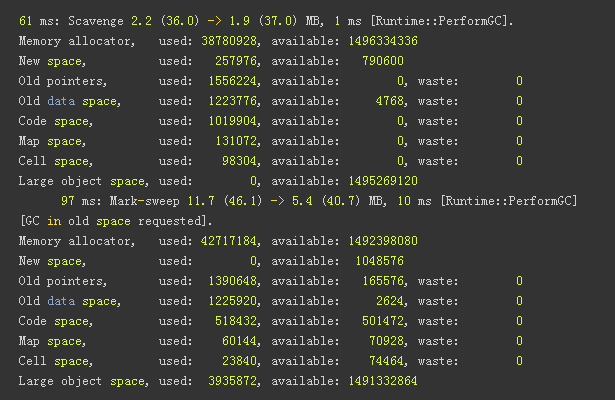
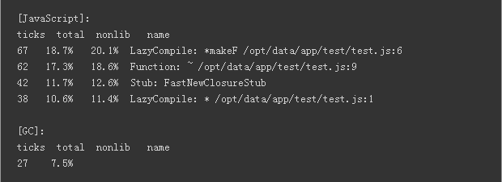

# NodeJs运维

* Server的管理
* 监控
* Log
* 调试

## Server管理方案

Server管理方案提供了一套从性能(负载均衡)、稳定性(reload、upstart)、可维护性(监控、log)等多个角度管理Node Server 多进程的解决方案。方案共有以下几部分组成：

### 生成upstart脚本
	
* upstart是Linux系统提供的一种在机器启动后自动运行用户配置服务并进程进程守护的能力
* Server管理会通过upstart功能确保机器启动后运行Node的服务

	fiscluster start ./app.js //production模式会自动生成upstart脚本

### 服务器多核利用

node提供了cluster模块，可以管理多个子进程，实现进程间的负载均衡,利用服务器的多核能力

```Javascript
var numCPUs = require('os').cpus().length;
var cluster = require('cluster')
cluster.setupMaster({exec: 'app.js'});
for (var i = 0; i < numCPUs; i++){
  cluster.fork();
}

### 零宕机重启

#### 描述

实现类似Nginx热重启的功能，在配置或者代码部署后能够做到服务不中断重启服务器。

#### 原理

主进程fork出新的子进程，同时控制已有子进程不再处理新的请求，等到已接受请求处理完成后关闭子进程实现零宕机重启功能。

#### 方案

[recluster](https://github.com/doxout/recluster)模块封装了node的原生cluster，提供了上述功能。Fis封装recluster提供类似下面命令：

	fis-cluster start ./app.js --name fis-app //启动一个应用
	fis-cluster restart --name fis-app 		  //热启动server，deploy脚本可以调用该命令

### 心跳检测

#### Nginx心跳检测

通过Nginx负载均衡的心跳检测确保请求不会被转发到出现故障的Node服务器

#### Server管理心跳检测

Server的管理服务也会有心跳检测功能，保证Node服务出问题可以自动热重启。大致思路如下：

```javascript
if (port) {
	process.env.PORT = port;
	setTimeout(function() {
	  setInterval(function() {
		var request = http.get('http://localhost:' + port, function(res) {
		  if ([200,302].indexOf(res.statusCode) == -1) {
			fiscluster.reload('[heartbeat] : FAIL with code ' + res.statusCode);
		  } else {
			util.log(' [heartbeat]:  OK [' + res.statusCode + ']');
		  }
		});
	  },heartbeatInterval);
	}, startupDelay);
}
```

## 监控

### Noah监控

* 处理器、内存、系统、磁盘监控使用Noah完成

### Server管理监控

复杂监控各Node子进程的运行状况，包括：

* 子进程占用的内存
* 子进程占用的Cpu
* 子进程的状态：online、stop、hang等

Noah插件的方式集成上述数据

## Log

### 种类 
   
#### webserver

服务器运行状况的相关日志

    access_log 请求日志
    error_log  web错误日志
    server.log  服务器上次启动错误信息

* 通过express中间件的方案实现webserver log统计

#### app

记录app程序运行的相关日志

* 日志的Level ： FATAL、WARNING、NOTICE、DEBUG
* 接口：

```php
Yogurt_Log::debug("debug_log");
Yogurt_Log::notice('query', 'value');
Yogurt_Log::warning('test notice log');
Yogurt_Log::fatal('test_fatal');
```

* 单独开发一个Yogurt_Log的Node模块实现

#### node

记录node各子进程的运行状况以及fatal error的log

* 由Server管理实现，对外提供API和命令版本，例如

	fiscluster log //获取所有的node子进程log日志
	fiscluster.log();

### 配置

	#  日志级别
	#  1：打印FATAL
	#  2：打印FATAL和WARNING
	#  4：打印FATAL、WARNING、NOTICE（线上程序正常运行时的配置）
	#  8：打印FATAL、WARNING、NOTICE、TRACE（线上程序异常时使用该配置）
	# 16：打印FATAL、WARNING、NOTICE、TRACE、DEBUG（测试环境配置）
	level: 16

	# 是否按小时自动分日志，设置为1时，日志被打在some-app.log.2011010101
	auto_rotate: 1

	# 日志文件路径是否增加一个基于app名称的子目录，例如：log/some-app/some-app.log
	# 该配置对于unknown-app同样生效
	use_sub_dir: 1

	# 配置日志的格式，Fis会提供默认的格式通常不需要配置
	format: %L: %t [%f:%N] errno[%E] logId[%l] uri[%U] user[%u] refer[%{referer}i] cookie[%{cookie}i] %S %M
	format_wf: %L: %{%m-%d %H:%M:%S}t %{app}x * %{pid}x [logid=%l filename=%f lineno=%N errno=%{err_no}x %{encoded_str_array}x errmsg=%{u_err_msg}x]

	# 提供绝对路径，日志存放的根目录
	log_path: /home/users/wangcheng/yogurt/log/

## 调试

### 背景

* 能够快速的定位Node程序中的内存、Cpu、缓存区等问题
* Fe对于上述问题接触较少并不是很熟悉

总结了目前常用的调试手段，方便开发人员快速的定位问题。

### Node.js进程GC log

Node自带的GC监控工具可以打出缓存区的运行情况，帮助我们确认是否因为缓存区暴增引起程序变慢

	node --trace_gc --trace_gc_verbose test.js



### V8 profiler

profiler可以很方便的帮助我们发现程序中的内存和Cpu的问题，快读定位到异常的方法中：

	#命令模式
	node --prof app.js
	npm install -g tick 
	node-tick-processor v8.log



v8 profiler同时提供了接口，这样我们可以通过程序的方式控制获取profiler日志。未来会考虑是否集成到fis-cluster中。

### Node调试 ：node-inspector

通过node-inspector可以帮助我们debug node程序。

## Nodejs运维平台(未来)

